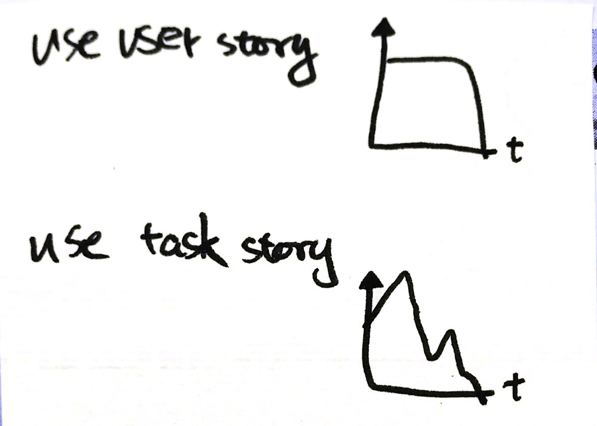
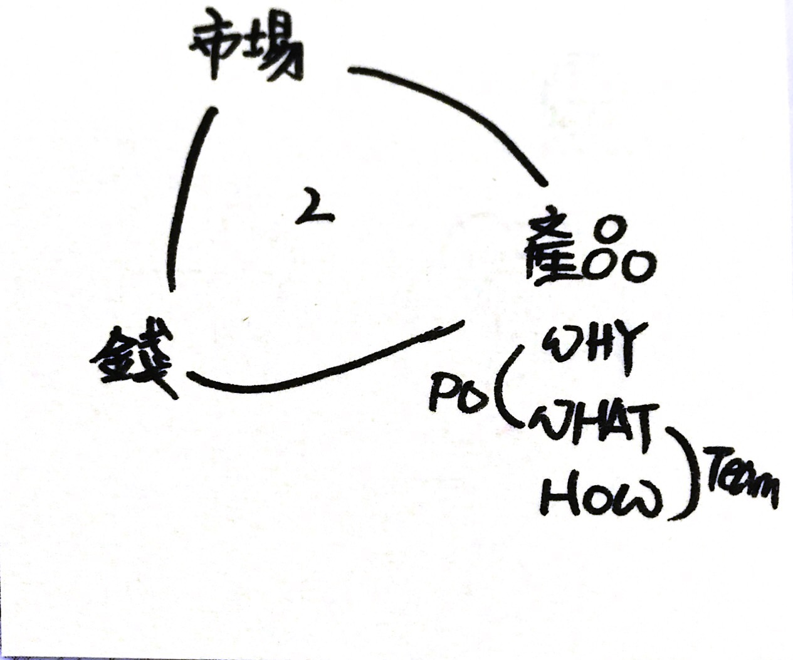
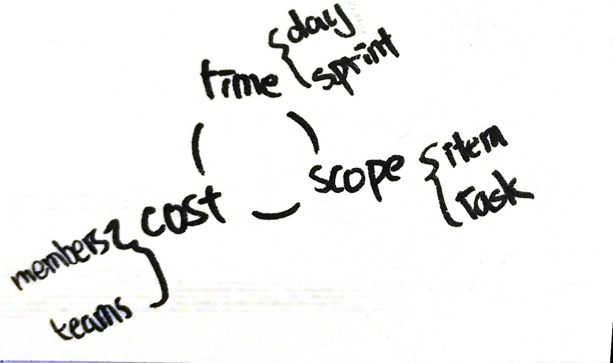
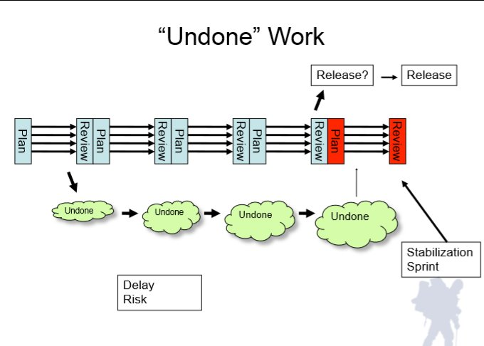
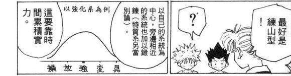

# Day 1

#### 燃盡圖的壞味道

如下，請忽略文字  
上圖使用 Item 作為 y 軸單位 ，下圖使用 Task 作為 y 軸單位，  
上圖直到最後一天，才瞬間完成所有 Item ，我稱之為跳崖式  
下圖是在 Sprint 的過程中，Task 增加了，有可能是亂入也有可能是建立 Task 時不準確，我稱之為登山式。

下圖的例子還算是樂觀的，畢竟最後 Sprint 都完成了，實務上更多是 Sprint Failed 。

> 我在 C 公司時是使用 Task ， N 公司是使用 Item ，在 N 公司與 Scrum Master 討論都建議使用 Item 繪製，最主要立論都在於 Item 才有價值，而 Task 只細部的工作項而已。但對於我的角色而言\(Team Member\)，能看見 Task 起伏很重要，往上爬待表 Task 變多了，可能的原因有插件、未預期的項目等…，可以作。  
>   
> 一個大原則， PO 看 Item，Team 看 Task。  
>   
> Product Backlog 使用 Item 沒有問題，因為是 PO 在看的。  
> Sprint Backlog 可以兩種都用，Task 燃盡圖可以看見 Task 的增加，或許使用 Kanban 就足夠了。  
>   
> **重點是，看見後要作什麼 ?**

#### 觀注點的不同

如上圖右下，在 Scrum 的角色中，PO 觀注 WHY & WHAT ； Team 觀注 WHAT & HOW ； 而 Scrum Master 觀注的點

> 上圖中間的部份，則是我個人猜想，世界上大部份事情都可以被拆成 3+1; 恰巧這個 Context 符合我的猜想，就是市場、產品、錢，那個 1 我沒想到就順手先畫了下來。  
> PO 觀注產品，目的要儘快的丟到市場去作測試，而達到盈利\(錢\)的目標。所以他要思考市場反應背後的原因\(WHY\)，設想策略，提供產品\(WHAT\)，最後才會 Break Down 成一個個 Product Log 再進到 Scrum 的循環之中，當團隊成功的交付了可發佈的產品，PO 才有了武器去市場作戰，才有機會取得回饋。

* Time
  * PO 觀注 Sprint
  * Team 觀注 Daily
* Scope
  * PO 觀注 Item
  * Team 觀注 Task
* Cost
  * PO 觀注 Teams
  * Team 觀注 members

UnDone 的工作項目有很多，這意味著半成品\(浪費\)。

### Done 、Undone & Debt

＊建議先看影片。



> 身為開發團隊，如果你有良好的開發工具，正確的工程實踐\(TDD、Code Review、Pair Programming etc…\)、提昇 Domain Know How 、更新 Skill Set 、開發時總不受干擾進入心流、擁有足夠的權限與資源… 那麼你就每次迭代你就能交付增量。


太理想了嗎 ?

* 在現實的考量中如何堅持開發者的良好實踐？ 
* 在缺乏實踐的環境如何導入？ 
* 在缺乏經驗的情況下如何學習 ？ 
* 在焦油坑中如何實踐 ？ 
* 你有說「不」的勇氣嗎？


回過頭來，如何定義完成，在 Scrum 的框架中對完成保留了很大的空間，PO 與 Team 的角度可能不儘相同，所以由團隊來定義，模糊的空間很大。

> 同樣的定義用來指導開發團隊，讓團隊知道在短衝計劃會議中可以選擇多少產品待辦事項。 每一個短衝的目的是交付潛在可發佈的功能增量，而這些功能符合 Scrum 團隊目前對 「完成」之定義。


由 PO 主導的 DoD 會由商務與 PO 個人績效導向\(如果有的話\)，而工程上的重要實踐往往會被犧牲，一方面是團隊成員對專業的堅持度不夠，一方面或許整體公司的開發文化就是如此。

這些事項是不是該落入 Task 之中 呢?

* Retro 後產生的 Action Item 
* 教育訓練 


Undone 的項目可是五花八門包羅萬像的，技術債、文件製作、修復錯誤等…，只要不符合完成的定義，是不是都算 Undone 呢 ? 但是有的時候的 Sprint Goal 是需要欠下一些債的，這中間是一個取捨與權衡的，所以記得保持透明；你或許需要一個 Undone Sprint 來消弭這些 Undone Task。

注意 Undone 是會影響開發速率的，在 **Scrum 之中開發速率應該是個關鍵指標**，不論你用 KPI、MBO 或 OKR 都應該觀注這個指標。而速率是由經驗法則測得。當然有時為了快速交付，有些暫解是在所難免，要小心[ LeBlanc's Law](https://en.wikipedia.org/wiki/Talk%3AList_of_eponymous_laws#Proposal_to_add_LeBlanc's_law)，這些債務能不能在團隊反應之前被覺察是可以透過觀察速率指標，  
  
在 Time、Cost 與 Scope 都被鎖死的情況下，結果往往是犧牲了品質。  
~~舉例說明: 這個東西 11 月底要，不能 Delay ，交由你們作\(不準增加開發成本\)，功能我全都要。~~

> 品質的犧牲我竟然相對覺得還好…更可怕的是，「管理者」為了滿足那個鐵三角，而作出一些虛妄狡詐之事。不僅僅是犧牲了品質，更給了高層錯誤訊息，甚至形成惡性循環，讓領導者作出錯誤判斷，更進一步的損耗品質。 最後成本提高、時間拉長與交付範圍不得不縮小，這不僅僅是鐵三角崩潰，連透明度與互信與也會失去。

**學習債 & Cross Learning**  
  
Scrum Team 的成員組成有個前提，團隊具備完成端到端的開發的所有技能。

* 開發團隊 3~9 人
* **開發團隊是跨職能的，團隊擁有產出產品增量所需要的所有技能。**

如果產品所需的 Skill Set 很大，[巴士因子](https://zh.wikipedia.org/wiki/巴士因子)就容易過低; 比如說一個七人的團隊，要製作一個包含 Web、App\(包含 iOS 、 Android \)的產品。人力與能力配置假設如下，而且 DoD 的定義為所有載具的交付，那麼這個團隊的風險極高 ; 實際的經驗會變成 Mini Water Fall 。這也意味著每當工作移轉到某個職能的負責人身上，當下就形成瓶頸。

| Alice |  Bob | Carol | Dave | Eve | Frank | Grace |
| :--- | :--- | :--- | :--- | :--- | :--- | :--- |
| UI/UX | Front-End | Back-End | iOS | Android | DBA | Tester |

讓我們換個情境來說明，同樣的七個人，如果每個具備的 Skill Set 彼此能夠互相援助，巴士因子就提高了，而工作分配會更容易些，較不易形成個人瓶頸\(當然還是有可能，比如說這個 Sprint 的 Items 都落在 DBA 身上之類 …\)，很明顯這樣的團隊組成更能適應變化。

<table>
  <thead>
    <tr>
      <th style="text-align:left">Alice</th>
      <th style="text-align:left">Bob</th>
      <th style="text-align:left">Carol</th>
      <th style="text-align:left">Dave</th>
      <th style="text-align:left">Eve</th>
      <th style="text-align:left">Frank</th>
      <th style="text-align:left">Grace</th>
    </tr>
  </thead>
  <tbody>
    <tr>
      <td style="text-align:left">
        
UI/UX

        
Front-End

      </td>
      <td style="text-align:left">
        
UX

        
Front-End

        
Back-End

      </td>
      <td style="text-align:left">
        
Back-End

        
DBA

        
Tester

      </td>
      <td style="text-align:left">
        
iOS

        
Android

        
Front-End

      </td>
      <td style="text-align:left">
        
Android

        
iOS

        
Tester

      </td>
      <td style="text-align:left">
        
DBA

        
Tester

      </td>
      <td style="text-align:left">
        
Tester

        
UI/UX
           
        

      </td>
    </tr>
  </tbody>
</table>


上面的團隊很理想，在人力市場上卻很難得到你想要的牌，所以才需要訓練，但是要花時間。  
但在開花結果之前會發生什麼事呢 ? 人員可能會離職、團隊會異動、團隊中有成員認為專精勝於通才\(強調一下，這沒有對錯，只是價值觀的不同\)


