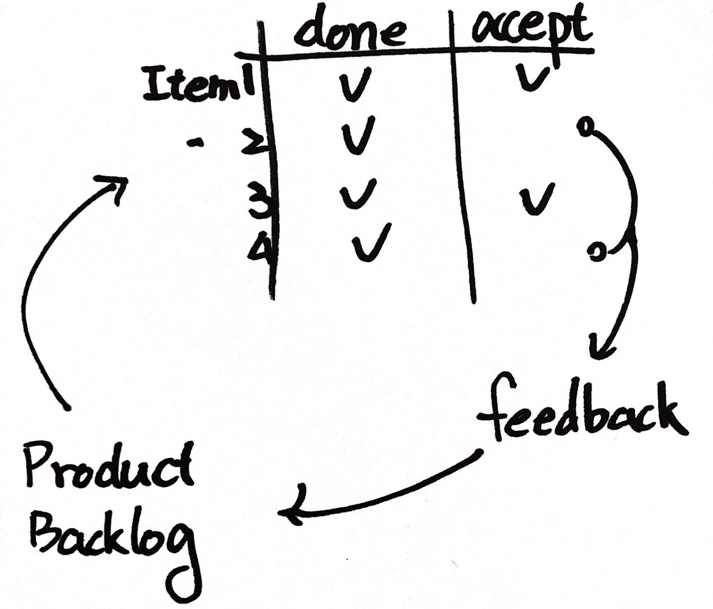

# Day 2.1

### Daily Scrum

* 建議 Time Box 15 mins，每日同時同地進行，注意避免超時。
* 目的是 Adapt，觀注 Item 而非 Task 
* Scrum Master 不是會議的中心；避免讓團隊成員變成對 Scrum Master 或 PO 報告
* Scrum Master 應減少
  * 發言
  * 眼神接觸
*  PO不一定需要每天參與Daily Scrum，但參與有助於問題的釐清
* 不討論細節，只確認現況\(Reality Check\)與目標\(Goal\)的差距，細節可會後釐清

補充: 

* [GROW](https://wiki.mbalib.com/zh-tw/GROW%E6%A8%A1%E5%9E%8B)
* 有的人就是很話澇，曾有團隊給每個成員紅/黃牌，當有人說得太久就給牌警告 XDDD
* Scrum Master 可以作的事
  * Does the team find the daily scrum useful ？ 成員有沒有發現站立的好處 ？
  * Do they manage themselves ？ 團隊是否自組織了？
  * Do they share their work ？ 他們的工作是共享的嗎 ？
  * Do they come prepared ？ 他們\(這個Sprint/Item/Task\)準備好了嗎 ？
  * Do they report unclear ？他們的說明是否易懂？
  * Does it take too long ？是不是太耗時了？

> 我在 C 社是下午 5:30 執行 Daily Scrum，在 N 社是早上 10:30。  
> 個人比較喜歡 C 社的作法，但有可能是被制約了，因為那是我第一個跑 Scrum 的團隊。
>
> 主觀的比較一下優缺點，
>
> > 下午執行的  
> > 優點：  
> > - 站立完就可以下班了。  
> > - 一早來就可以根據昨天的站立進行開發。  
> > 缺點：  
> > - 站立講不清楚就會拖到下班，人性會選擇甘脆不講。  
> > - 第二天一來忘了昨天說什麼了啦
> >
> > 上午執行的  
> > 優點：  
> > - 站完就可以開始一天的工作  
> > - 剛站完比較不會忘   
> > 缺點：  
> > - 10:30 站立就會有人10:30才進公司，提早來反而沒人問\(但是安靜\)  
> > - 如果有會後討論，一不小心就中午了呢\(一ω一\)

### Sprint Review & Retrospective

#### Review

* 展示我們完成了「什麼\(What\)」\(面對 Stakeholder 練習別說技術語言\)
* 建立 Product Owner 與 Stakeholder 的信任
* 取得來自 Product Owner 與 Stakeholder 的 Feedback 
* 圍繞著 Product 進行 Inspect 與 Adapt
* Team Member 完成某些 Task 或 Item 之時，就可以找 PO 進行 View \(Just In Time Review\)

####  Retro

* 觀注我們是「怎麼\(How\)」作的
* 圍繞著 Process 進行 Inspect 與 Adapt
* 從經驗中學習，改進 

