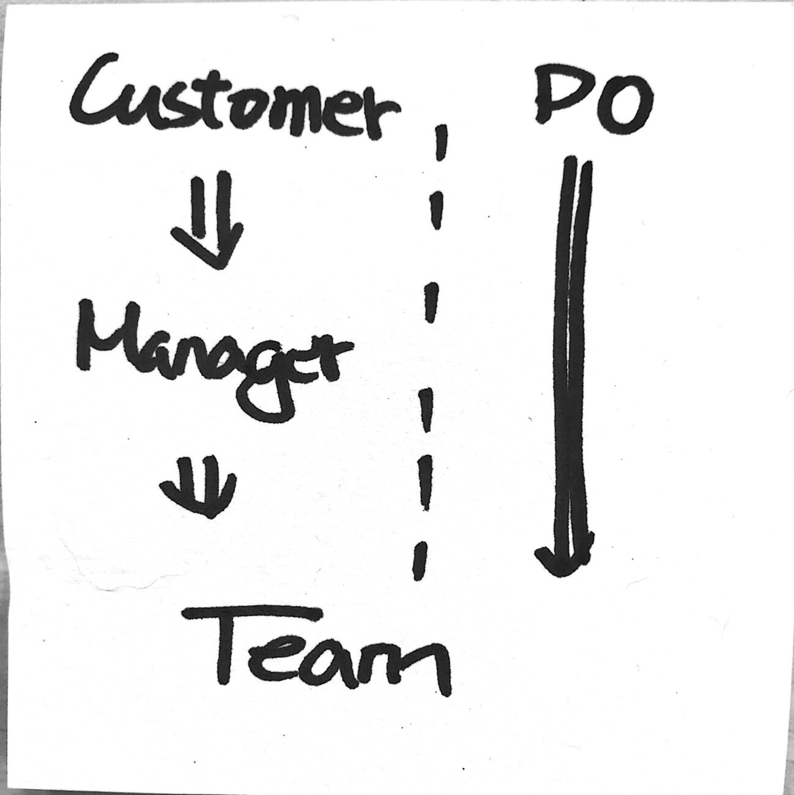
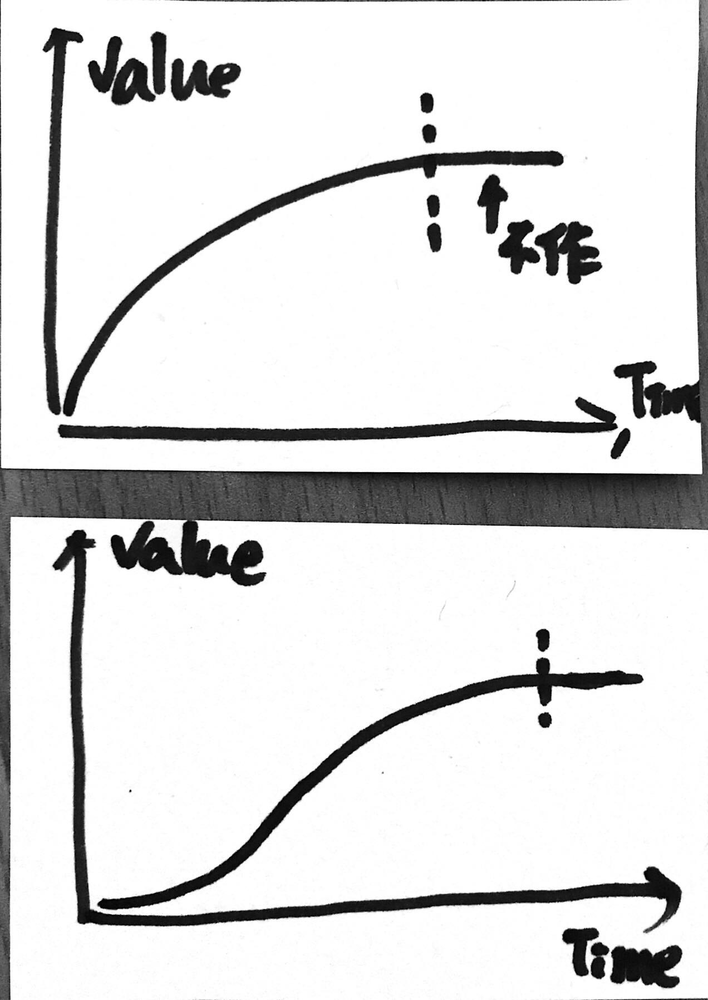

# Day 2.3

### Scrum Master

哪些人適合作 Scrum Master ? 常見組織轉型時會直覺的找現有的角色作 Scrum Master ，但是 Scrum Master 是一個 **Couching** 的角色，傳統公司裡面並沒有 **Couching** 的角色，通常都行不通的。

> 傳統公司裡面的 Manager ，要麼是 R&D 的 Manager ，要麼是 PMO 的 Manager。通常會有幾個問題  
> 1. R&D 通常由資深RD升上來，但是不善於管理\(彼得效應\)  
> 2. PMO 會有自已與部門的考績考量，而這不一定能瞄準市場目標  
> 3. 通常工作都會由 Manager 分派，而不是由成員主動爭取  
> 4. 失敗的時候，總要有人背鍋，那個人就是 Manager \(但是實務上常常看到 Manager 丟鍋給成員\)  
> ~~5. 不太關注成員的成長。~~\(好啦，也許有的有\)  
> 6. Manager 要作太多的決策

### Scrum Master 不是 Decision maker

情境：當 Team Member 無法決定求助 Scrum Master 時。  
解法：也要看情境，干預或不干預是要付出成本的。  
你要關心「風險」與「成長」，在沒有風險的情境下 Scrum Master 應該引導團隊自行作決定。  
問問題是一個好的引導方式，過多的干預會讓團隊無法成長。

以小孩作比喻

| 情境 | 作法 |
| :--- | :--- |
| 小孩爬桌子（低風險） | 讓團隊試試看，讓團隊學習、成長。 |
| 小孩爬馬路（高風險） | 作出Decision，避免失敗\(失敗就沒有下一次\) |
| 別人家的孩子爬桌子（不穩定的團隊） | 防東防西，風險至上\(他成不成長干我啥事?\) |

如果把時間拉長一點，可以觀察出自已的取捨是否太偏向某一方\(風險 or 成長\)，  
比如說幾個月，如果團隊仍無法自行決定，可能是你\( Scrum Master \)干預太多了，  
Scrum Master 每一個決定都會影響到團隊。  
Scrum Master 應該給自已訂一些目標，來判斷自已的取捨是否合理。

Ex:

* 團隊是否會自行分工
* 團隊是否會自行作決定
* 團隊是否會蜂擁處理最高優先權的東西
* more…

更多情況 Scrum Master 不見得能作 Decision。

Scrum Master 的責任

* Coach PO

  * 消除客戶與開發之間的障礙
  * 教導 PO 如何透過 Scrum 最有效率達到目標\(How to maximize ROI and meet their objectives through Scrum \) 

  以下圖來說，Y 軸代表價值，X 軸代表時間。上圖的策略表示產品初期就發佈高價值的增量，隨著時間過去，單位時間能帶來的價值太少時，也許我們就不作了\(虛線之後\)，因為不符成本。  
  而實務上，可能會更接近下圖，在初期有些基礎建設，這些建設不一定能帶來較高的\(客戶\)價值，但是可以降低風險，有時候更可能是初期必要的相依項目。這兩種策略沒有好壞，關鍵點仍是要能結合你的產品，與 PO 共同討論出取捨的方向。

* Coach Team
* 
