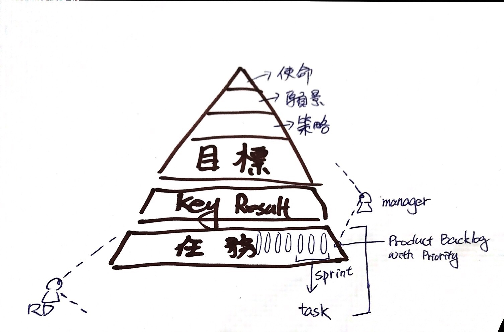
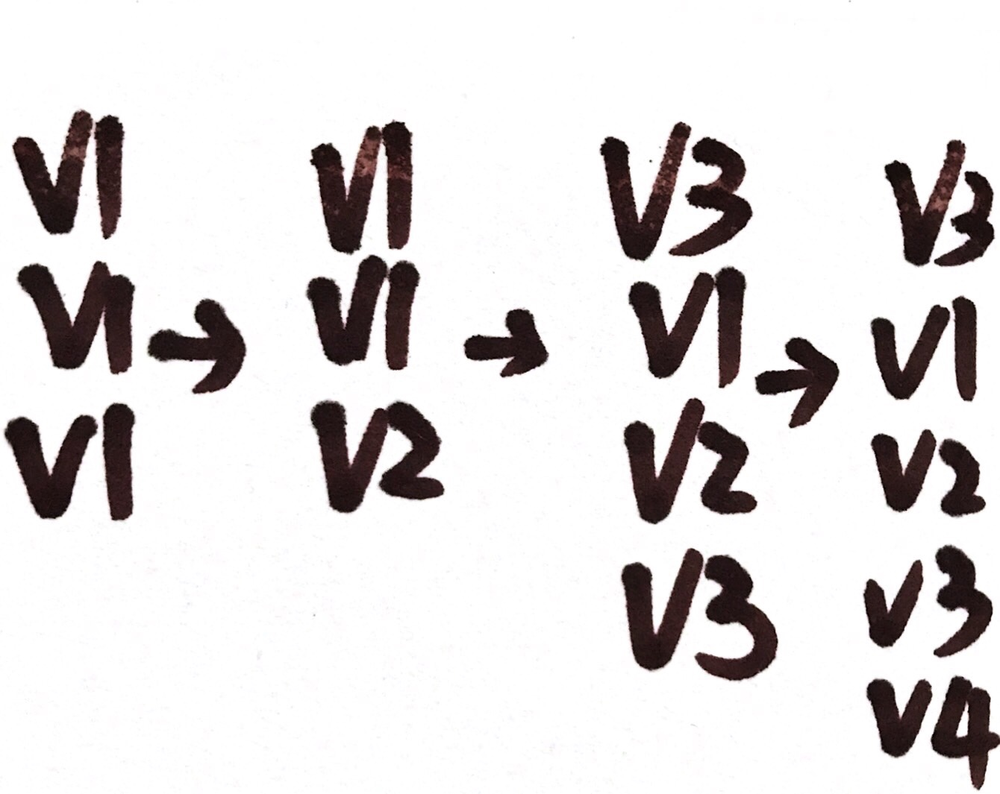

# Day 2

### Planning \(with 2~4 hours timebox\)

#### Planning 第一階段

* 說明要作什麼\(What\)。
* 對Item估點。
  * 基於 Velocity
  * 基於 Commitment

> Velocity-Driven 或 Commitment-Driven 哪個比較好呢？  
> 大多數的 Scrum Master 恐怕會跟你說團隊決定。  
> 兩者的差異點在哪裡呢 ？ **Scrum 是立基於經驗導向的流程控制理論**  
> Velocity 有數據佐証，較為客觀；但是 Team members 與 Backlog Item 其實都是會變動的\(理想上當然是穩定更好\)，如果 PO 與 Team 的互信足夠，Commitment 其實也可以符合經驗導向，比如說：「 我的Develop Team 平均每個 Sprint裡面可以交付 90% 的 Item。」  
> 換句話說還是團隊決定，但是彈性是很大的，或許 Develop Team 有信心時使用 Commitment ，而團隊缺乏信心時或許可以用過往的 Velocity 作為標準。

#### Planning 第二階段

* 組織 Task 以達到
* 接受來自第一階段的 Backlog Items
  * 要相信「Velocity」
  * 不要馬上分派 Task
    * 會形成 Silo ，被分派者會提早將專注力從 Item 移到 Task 上
    * 保持專注在 Item 上
* 對Task估時。
  * 別忘了 Backlog Refactoring 的時間
  * 在 Timebox 裡面解決能解決的問題
  * Maintain → 用經驗法則抓一點 Buffer 吧
  * 估時請包含假勤/會議/教育訓練…etc

#### Scrum Master 的 CheckList

* Product Backlog Item 排序
  * 上一個 Sprint 未完成的 Item 
  * Review Meeting 的反饋所產生的 Action Item
  * Acceptance Criteria 是否已經定義清楚了？
    * 需視 Scrum Team的流程定義
    * User Story 的 Descriptions & Acceptance criteria希望是PO與團隊一起共同完成。
      * 實務上蠻花時間的，寫出來的效果也不見得很好。\(\*也許是我們的操作方法不對\)
    * User story是用來溝通的，不是用來寫的！
  * 是否有人請假？ 
    * 可以提前確認
    * 有人請假要評估是否吃得下？
    * 吃不吃得下團隊評估

> PO 在 Sprint 中一直塞東西是不是一種不信任團隊的壞味道？  
> Team 毫無反應，就只是個接 Task 的 Team 是不是也是一種不信任？

> 我對 OKR 與 Sprint Goal 的認知。  
> 不難理解為什麼 RD 會覺得干我屁事，又沒加薪也沒獎金，用口說就能讓人激勵人心太難了。  
> 比如說：[作功德](https://www.ettoday.net/news/20171125/1059745.htm)，最後反而會讓第一線人當成幹話，幹話聽多了失去信任就更糟糕了。

#### Team

適當的領取 Item，過多的 Item 進去，只會在 Sprint 結束時，有一堆半成品。  
而半成品在面對\(市場\)變化，失去產品的彈性。

> 軟體\(代碼\)的優化與重構只作一半，算不算是半成品？  
> 軟體隨著架構或相依的套件升級或補丁，在 Sprint 期間通常會有必要升級或是改變寫法。  
> 最後就變成下圖，擁有各種版本的 Code Base，  
> 這會拖慢開發速度，讓新進成員難以理解，也難以用 Code Review 或自動化 Tool 解決，  
> 目前比較理想的解法是 Pair-Programming 與時時重構。
>
> **可是，PO願意花費這個時間去調整嗎？ 可以用 Veloctiy 變低當作參考嗎？  
> Veloctiy 變低的原因有很多種。又或者由 Team 自行決定？那如果使用的 Code Base 是跨 Team 的產品又該如何 \(拆掉變成微服務？\)。 Team 要能自行組織要多久時間呢 ？「不是拿掉主管，團隊就能自組織」; 同樣的拆成微服務又需要多久時間呢？  
>   
> 記住，對 PO 來說，這是沒有商業價值的事。**  
> 註記：或許這只是個過度理想化的偽議題，畢竟「凡存在，必合理」。

### Daily Scrum

