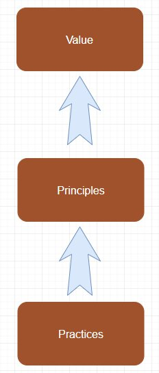

# 敏捷宣言背後的原則

## 敏捷宣言背後的原則

  
我們遵守這些原則:

我們最優先的任務，  
是透過及早並持續地交付有價值的軟體  
來滿足客戶需求。

竭誠歡迎改變需求，甚至已處開發後期亦然。  
敏捷流程掌控變更，以維護客戶的競爭優勢。

> 取得變化的平衡，  
> 實踐基於原則，而原則基於價值，敏捷的價值在於提供客戶價值。

經常交付可用的軟體，  
頻率可以從數週到數個月，  
以較短時間間隔為佳。

業務人員與開發者  
必須在專案全程中天天一起工作。

以積極的個人來建構專案，  
給予他們所需的環境與支援，  
並信任他們可以完成工作。

面對面的溝通  
是傳遞資訊給開發團隊及團隊成員之間  
效率最高且效果最佳的方法。

可用的軟體是最主要的進度量測方法。

敏捷程序提倡可持續的開發。  
贊助者、開發者及使用者應當能不斷地維持穩定的步調。

持續追求優越的技術與優良的設計，  
以強化敏捷性。

精簡──或最大化未完成工作量之技藝──是不可或缺的。

> 精簡包含工作流程與產品功能，  
> 最近剛好和同事討論到這議題，軟體之死--在於自我膨脹，過多擁腫而無用的功能…  
> 胖不是罪，但是胖到不靈活就…後述

最佳的架構、需求與設計皆來自於  
能自我組織的團隊。

團隊定期自省如何更有效率，  
並據之適當地調整與修正自己的行為。

## Principles behind the Agile Manifesto

  
  
We follow these principles:

Our highest priority is to satisfy the customer  
through early and continuous delivery  
of valuable software.

Welcome changing requirements, even late in   
development. Agile processes harness change for   
the customer's competitive advantage.

Deliver working software frequently, from a   
couple of weeks to a couple of months, with a   
preference to the shorter timescale.

Business people and developers must work   
together daily throughout the project.

Build projects around motivated individuals.   
Give them the environment and support they need,   
and trust them to get the job done.

The most efficient and effective method of   
conveying information to and within a development   
team is face-to-face conversation.

Working software is the primary measure of progress.

Agile processes promote sustainable development.   
The sponsors, developers, and users should be able   
to maintain a constant pace indefinitely.

Continuous attention to technical excellence   
and good design enhances agility.

Simplicity--the art of maximizing the amount   
of work not done--is essential.

The best architectures, requirements, and designs   
emerge from self-organizing teams.

At regular intervals, the team reflects on how   
to become more effective, then tunes and adjusts   
its behavior accordingly.

