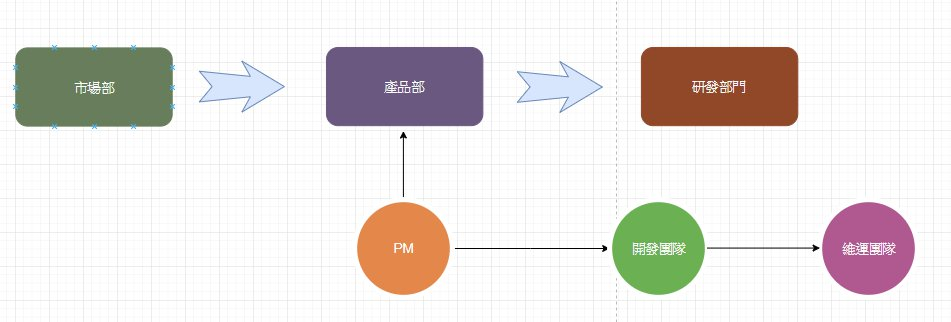

# Scrum 團隊

Scrum 團隊由產品負責人、開發團隊和一位 Scrum Master 組成。Scrum 團隊是一個自我組 織和跨職能的團隊。自我組織的團隊會自行選擇最好的方式來完成工作，而不是被團隊外 的人指示如何做。跨職能的團隊不需依靠非團隊成員而擁有所有完成工作所必備的能力。 Scrum 中的團隊模式是設計用來將彈性、創意、和生產力最大化。Scrum 團隊必須證明自 己在前述的情況和錯綜複雜的工作中越來越有效。 

Scrum 團隊用迭代和逐步增量的方式交付產品，將回饋的機會最大化。用逐步增量的方式交付「完成」的產品，可以確保一直提供一個潛在可用的產品版本。

### 產品負責人

產品負責人負責將產品的價值最大化，而價值來自於開發團隊的工作成果。如何做到這點可能在每個組織、Scrum 團隊、或個人，都差異很大。

產品負責人這個角色只能由一個人來擔任，專門負責管理產品待辦清單。產品待辦清單管理包含：   
● 清楚的表達產品待辦事項；  
● 針對產品待辦清單上的事項進行排序來達到最好的目標和使命；  
● 將開發團隊工作所產生的價值最佳化   
● 確保產品待辦清單是每個人都可以看見的、是有透明度的、以及清晰瞭解的，而且可以顯示出 Scrum 團隊接下來要做的事；和  
● 確保開發團隊對產品待辦事項的了解有到達所需要的程度。  
產品負責人可以自己做以上的工作，或由開發團隊來做。但不管如何都是由產品負責人當責。 

產品負責人是由一個人來擔任，而不是一個委員會。產品負責人可能代表一個委員會對於產品待辦清單的期望要求，但任何人想要改變產品待辦事項的優先順序，都需要經過產品負責人的同意。

要讓產品負責人成功，整個組織必須尊重他/她的決定。產品負責人對於產品待辦事項內容和順序之決定是透明的，沒有人可以強迫開發團隊做產品待辦清單以外的需求。


傳統的 PM 角色明顯與此處所說的 PO 不同，我遇見的問題有

1. PM 沒有權限決定產品的目標與使命
2. PM 是老闆或是產品部門的代理人，這樣帶來了一些缺點
   * 不透明 : 業務/市場的訊息本身會被產品部門過濾，目的是為了「保護開發團隊不被打擾」
   * 老闆或部門主管會跨越或施壓 PM ，對開發團隊下指令

Q. 如何改善上述情境 ?


### 開發團隊

開發團隊由一群專業人士組成，他們可以在每個短衝結束時交付「完成」潛在可發佈的產品增量。「完成」的產品增量必須在短衝檢視會議上呈現。只有開發團隊的成員可以產生產品增量。

組織建立並授權開發團隊，讓他們可以自行組織和管理他們自己的工作。所達成的綜效可讓開發團隊整體的效率和效能達到最大化。

開發團隊有以下的特性：

● 他們是自我組織的。沒有人（甚至是 Scrum Master）可以跟開發團隊下指導棋，告訴他們如何把產品待辦清單轉換成潛在可發佈的產品增量；  
● 開發團隊是跨職能的，團隊擁有產出產品增量所需要的所有技能；  
● Scrum 認為開發團隊成員沒有職稱，不管個人所做的工作是什麼；  
● Scrum 認為團隊中沒有小團隊，不管需要解決的是什麼領域，如測試、架構、營運或商業分析；和  
● 開發團隊成員雖然可能各自有專精的技能和領域，但仍是由團隊整體來當責。

#### **開發團隊的大小**

最理想的團隊大小，是小到足夠靈活而且大到能夠完成短衝內重大的工作。少於三個人的團隊成員之間的互動會減少，以至於只能提升小部分的生產力。小一點的團隊可能會在短衝中遇到技能的限制，使得開發團隊無法交付潛在可發佈的產品增量。如果成員多過九個人則會造成太多的協調。大的團隊產生太多的複雜性，而使得經驗導向的流程沒辦法那麼有效。產品負責人和 Scrum Master 的角色並不包含在團隊人數中，除非他們也執行短衝待辦清單上的工作。


Q1. 現實上的目標團隊能力不足如何處理 ? Scrum 並沒有處理 HR 的解決方案

Q2. 跨職能團隊要具備所有能力，在大的目標上有點不現實，舉例來說 : 一個功能需要 WEB/APP\(IOS&Android\)/F2E/QA/DBA/Infra/UI  etc… ，若是團隊成員中有牛人可以橫跨多個項目當然很好，但實務上多為1、2項專精的人才組成的團隊，勢必需要其他團隊的協助。

Q3. 同上，現有人才技能無法互相 Cover 怎麼辦 ? 一棒傳一棒的開發方式變成了 mini waterfall，最後一棒永遠沒有足夠的時間。

Q4. 組織改組時，即有的團隊組織，Scrum Team 會讓會議過多。


### Scrum Master

Scrum Master 依照 Scrum 指南中的遊戲規則來負責推廣和支持 Scrum。Scrum Master 幫助每個人了解 Scrum 的理論、實務、規則和價值觀，來達成推動 Scrum。

對於 Scrum 團隊來說，Scrum Master 是一個僕人式的領導。Scrum Master 幫助團隊外的人了解哪些與團隊之間的互動是有幫助的，而哪些是沒有幫助的。Scrum Master 幫助每個人改變這些互動的方式，讓 Scrum 團隊產生的價值能夠最大化。

#### Scrum Master 對產品負責人提供的服務

Scrum Master 對產品負責人提供多方面的服務，包含：

● 確保 Scrum 團隊的每位成員都盡可能地理解目標、範圍與產品領域；   
****● 找出有效管理產品待辦清單的技巧；   
● 幫助 Scrum 團隊理解為什麼需要清楚簡潔的產品待辦事項；   
● 在經驗導向的環境中理解產品規劃；  
● 確保產品負責人知道如何安排產品待辦清單來讓價值最大化；  
● 理解和實踐敏捷；與   
● 當需要或被要求時，引導 Scrum 活動的進行。

#### Scrum Master 對開發團隊提供的服務

Scrum Master 對開發團隊提供多方面的服務，包含：

● 作為教練指導開發團隊如何自我組織和跨職能；   
● 幫助開發團隊創造高價值的產品；   
● 移除開發團隊在過程中的障礙；  
● 當需要或被要求時，引導 Scrum 活動的進行；與   
● 在組織環境還沒有完全採用與理解 Scrum 的情況下，作為教練指導開發團隊。

####  Scrum Master 對組織提供的服務

● Scrum Master 對組織提供多方面的服務，包含：  
● 帶領和作為教練指導組織來採用 Scrum；  
● 規劃 Scrum 在組織內的實施；  
● 幫助員工和利害關係人理解及制定 Scrum 與經驗導向的產品開發；  
● 造成改變來增加 Scrum 團隊的生產力；  
● 與其他 Scrum Master 一起合作來加強組織內 Scrum 應用的有效性。

